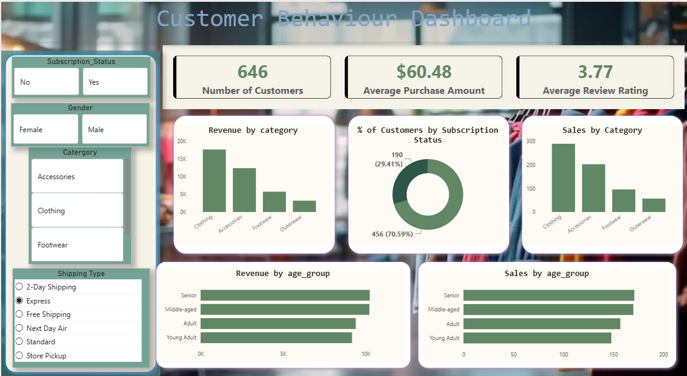

# Customer Behavior Project

An end-to-end Data Analytics project built using **Python, SQL, Power BI, GitHub, and Gamma AI**, following an industry-standard workflow from raw data to business insights.

---

##  Project Overview

This project demonstrates a complete Data Analytics workflow similar to what Data Analysts perform in real organizations. It covers every stage of the analytics lifecycle—from understanding the business problem to creating dashboards and presenting insights.

### 🎯 Objectives

- Define a business problem
- Clean and prepare raw data using Python
- Perform Exploratory Data Analysis (EDA)
- Store data in SQL Database
- Analyze business problems using SQL
- Create an interactive Power BI dashboard
- Generate a project report
- Prepare a presentation using Gamma AI

---

# 📊 Project Workflow

```
Business Problem
        │
        ▼
Python (Data Cleaning & EDA)
        │
        ▼
SQL Database
        │
        ▼
SQL Analysis
        │
        ▼
Power BI Dashboard
        │
        ▼
Project Report
        │
        ▼
Presentation (Gamma AI)
```

---

# 🛠️ Tech Stack

- 🐍 Python (Pandas, NumPy)
- 📊 Power BI
- 🗄️ SQL (MySQL)
- 📒 Jupyter Notebook
- 📑 Gamma AI
- 🌐 Git & GitHub

---

# 🚀 Features

- ✅ Data Cleaning using Python
- ✅ Exploratory Data Analysis (EDA)
- ✅ SQL Database Integration
- ✅ Business Insights using SQL Queries
- ✅ Interactive Power BI Dashboard
- ✅ Customer Segmentation Analysis
- ✅ Sales & Purchase Trend Analysis
- ✅ Project Report
- ✅ Presentation using Gamma AI
- ✅ GitHub Portfolio Ready

---

# 📈 Project Phases

### Phase 1
Business Problem Statement

### Phase 2
Import Dataset into Python

### Phase 3
Data Cleaning & Preprocessing

### Phase 4
Exploratory Data Analysis (EDA)

### Phase 5
Load Data into SQL Database

### Phase 6
Business Analysis using SQL

### Phase 7
Interactive Dashboard in Power BI

### Phase 8
Business Report

### Phase 9
Presentation using Gamma AI

---

## Dashboard

<p align="center">

</p>

---
